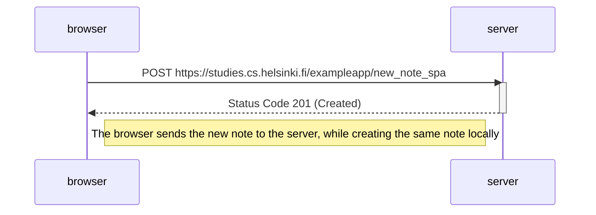

```mermaid

sequenceDiagram
    participant browser
    participant server

    browser->>server: POST https://studies.cs.helsinki.fi/exampleapp/new_note_spa
    activate server
    server-->>browser: Status Code 201 (Created)
    deactivate server

    Note right of browser: The browser sends the new note to the server, while creating the same note locally

```
